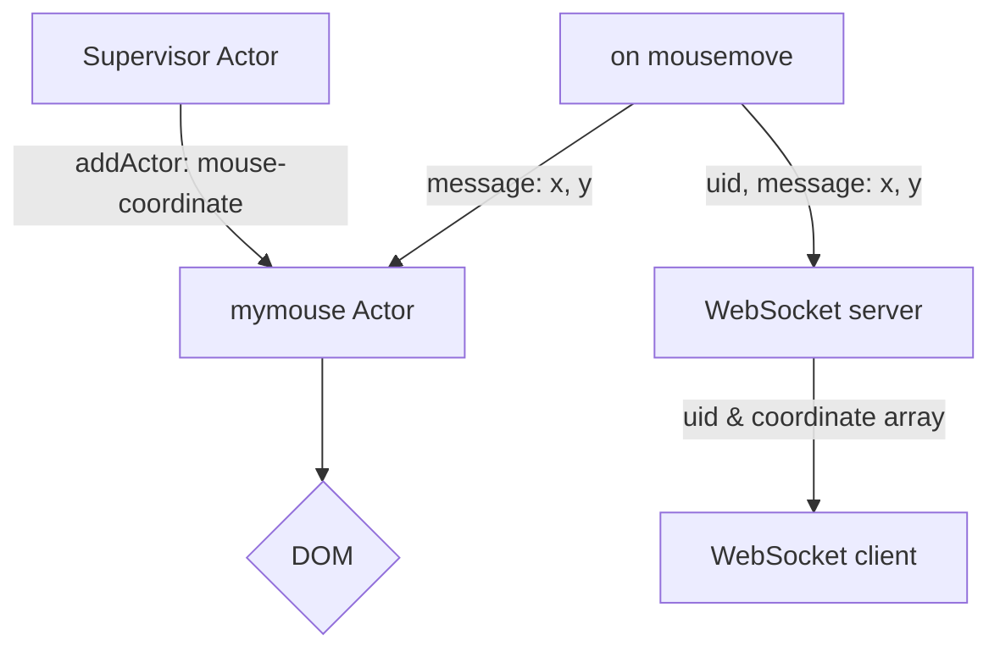

# Multiple Cursors Challenge

Challenge -- each client sees every other client's mouse cursor
    1. supervisor-actor creates generator- and destroyer-actors
    2. generator-actor is responsible for adding new coordinate-actors
    3. destroyer-actor is responsible for removing coordinate-actors
    
  Use fetch (AJAX) to log per client files via PHP script on a public server (test locally between to browser tabs)

    1. when self-client spawns, the supervisor-actor publishes self to actor-list log on server

      a. returns a UID from server

    2. each N seconds the supervisor-actor publishes a list of 1s worth of self-coordinates to coordinate log on server

    3. each N seconds the supervisor-actor subscribes to an actor-list log from server

      a. supervisor delegates actor-list to generator- and destroyer-actors

      b. new coordinate-actors get generated

      c. absent coordinate-actors get destroyed

    4. each N seconds the supervisor-actor subscribes to each coordinate-actor's log from server

      a. corresponding coordinate-actors get updated

    5. when self-client unspawns, the supervisor-actor publishes remove event to actor-list log on server

    6. destroyer actor destroys stale coordinate-actors after M seconds
## Component Diagram



<!-- ## How to run the program

1. Clone repository: 'git clone https://github.com/TarunTheo13/multiple_cursors_challenge.git'
2. Run: 'php -S 0.0.0.0:80 > /dev/null 2>&1 &' 
3. Run websocket server: 'node WebSocketServer.js'-->


  <!-- ## Class Diagram

```mermaid
classDiagram
    index <|-- Actor
    index <|-- Interface
    index <|-- WebSocket
    index : style
    index : body
    class Actor{
        #state
        #inbox
        #procesors
        name
        getstate(key)
        send(message) 
        processInbox() 
        addProcessor(func)
        +addActor(message, self)
        +actorLoop()
    }
    class Interface{
    }
    class WebSocket{
    }
``` -->
